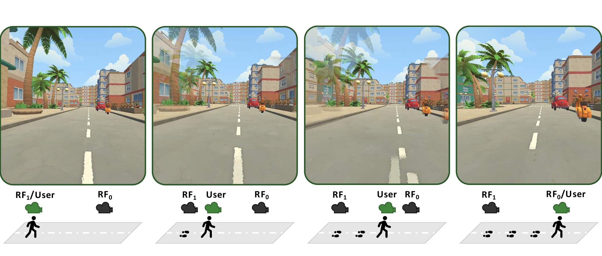

# Peripheral Teleportation
The implementation for a novel cybersickness mitigation technique called Peripheral Teleportation. An evaluation of this technique is published in our IEEE VR 2025 paper "[Peripheral Teleportation: A Rest Frame Design to Mitigate Cybersickness During Virtual Locomotion](https://ieeexplore.ieee.org/abstract/document/10918856)"


<div align = 'center'>


An example showing the mechanism of Peripheral Teleportation.

<br>
</div>

## Usage instructions

1) Clone this repository into the `Assets` folder of your Unity project.

2) To use this technique in your own Unity project, you can attach the `PeripheralTeleportationCS.cs` script to your main camera. 

3) Fill out the corresponding motion parameters for fields `

4) When the script is enabled, you can leave most of the fields by default. Set the move providers to the action based continusous move / turn provider in your own project. Create two game objects and attach two cameras under each game ojbect. Set the fields auxRig0 and auxRig1 to the two objects. Set the cameras to auxCam0Left, auxCam0Right, auxCam1Left, and auxCam1Right.

5) Run the project and start moving around.

## Bibtex
```
@article{Nie_Perpheral_2025,
  author={Nie, Tongyu and Pospick, Courtney Hutton and Cantory, Ville and Zhang, Danhua and DeGuzman, Jasmine Joyce and Interrante, Victoria and Adhanom, Isayas Berhe and Rosenberg, Evan Suma},
  journal={IEEE Transactions on Visualization and Computer Graphics}, 
  title={Peripheral Teleportation: A Rest Frame Design to Mitigate Cybersickness During Virtual Locomotion}, 
  year={2025},
  volume={31},
  number={5},
  pages={2891-2900},
  doi={10.1109/TVCG.2025.3549568}
}
```
